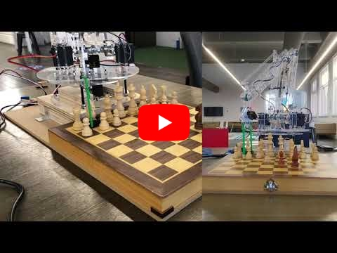

<h1>Anton Pollak</h1>

<strong>MSc Robotics, Systems and Control student at ETH Zurich</strong>

<a href="https://github.com/acpoll">https://github.com/acpoll</a>

## Current projects
### *Semester Project*: Improving autonomous navigation for ANYmal quadruped using a gradient-based planner
- Continuation of a project from the Spring 2025 *Perception and Learning for Robotics* class at ETH's Robotic Systems Lab

---

### *ForzaETH*: Robotics Engineer Volunteer
- Student project at ETH's Center for Project-based Learning ([website](https://www.forzaeth.ch/))
- Currently rebuilding the mobile platform and integrating it with the existing software stack 

    

---
---
## Previous projects
### *Safe Exploration via Policy Priors*
- Contribution to the research project at the Learning & Adaptive Systems Group, ETH Zurich
- NeurIPS workshop paper: [SOOPER](https://yardenas.github.io/sooper/)

    

### *Autonomous River Cleanup (ARC)*: Robotics Engineer Volunteer
- Student project at the Robotic Systems Lab ETH ([website](https://riverclean.ethz.ch))
- Working on the Mobile Autonomous Recycling Container (MARC) with ROS Noetic (robot planning, computer vision, state machine)

    
    

---

### *Stereofog*: Image-to-image machine translation enables computational defogging in real-world images
- Research internship at the University of Utah, USA
- Scholarship by the German Academic Exchange Service (DAAD)
- Paper published in Optics Express: [DOI](https://doi.org/10.1364/OE.532576)
- Further info on Github page: [GitHub](https://github.com/acpoll/stereofog)
- Internal lab presentation: [YouTube](https://youtu.be/P8lyz_wZo2c)

    

---

### *Bachelor thesis*: Optimized Operation Management With Predicted Filling Levels of the Litter Bins for a Fleet of Autonomous Urban Service Robots
- Within MARBLE (**M**obile **A**utonomous **R**o**B**ot for **L**itter Bin **E**mptying) project at TU Berlin
- Paper published in IEEE Access: [DOI](https://doi.org/10.1109/access.2024.3352436)

    

---

### *Real-World Robotics* class: Construction of a Robotic Hand and Application of Imitation Learning
- Class of Fall 2024 at the Soft Robotics Lab at ETH
- 3 main tasks:
    - Hardware design of a robotic hand based on a design provided by the lab
    - Execution of teleoperation tasks with the hand mounted on a Franka Emika robotic arm
    - Application of Imitation Learning for autonomous cube sorting

- Low-cost high-sensitivity pressure sensors using Force Sensitive Resistors (FSRs)
- Imitation learning using Action Chunking Transformer (ACT) [^1]
- Code cannot be shared yet due to unpublished research

      

---

### *Vision Algorithms for Mobile Robotics* class: Visual Odometry Pipeline Project
- Class of Fall 2024 at the Robotics and Perception Group (RPG) at University of Zurich
- Group bonus project: Design of a visual odometry pipeline ([GitHub](https://github.com/jvw01/monocular-vo), Final demo video: [YouTube](https://youtu.be/iMiLZzel61M))
- Techniques used: Shi-Tomasi algorithm, SIFT, Kanade-Lucas- Tomasi (KLT) algorithm, RANSAC  [^2]

     
    

---

### *Robotics Systems* class: Chess-playing Robotic Arm
- During exchange semester at the University of Melbourne, Australia
- Construction of a robotic arm to manipulate pieces on a chess board & implementation from scratch in Matlab
- Link to final demo video: [YouTube](https://youtu.be/MSCJdkJYSEA)

<!-- 

     

 -->

      

---

[^1]: [Action Chunking Transformer paper](https://arxiv.org/pdf/2304.13705)

[^2]: Image attribution: [KITTI dataset](https://www.cvlibs.net/datasets/kitti/)

---

Used template: https://github.com/plpxsk/primer-template/tree/main
