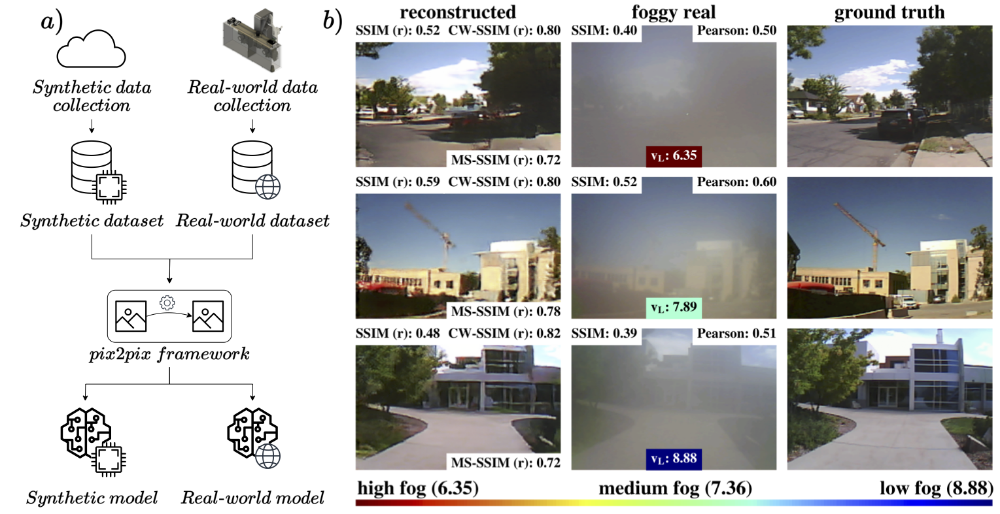
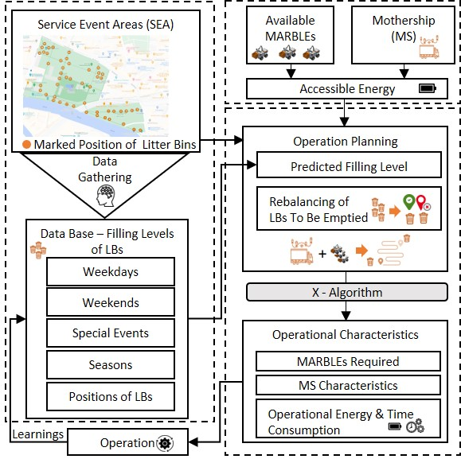
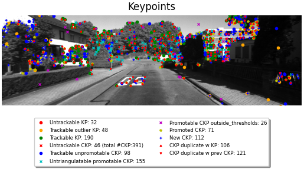
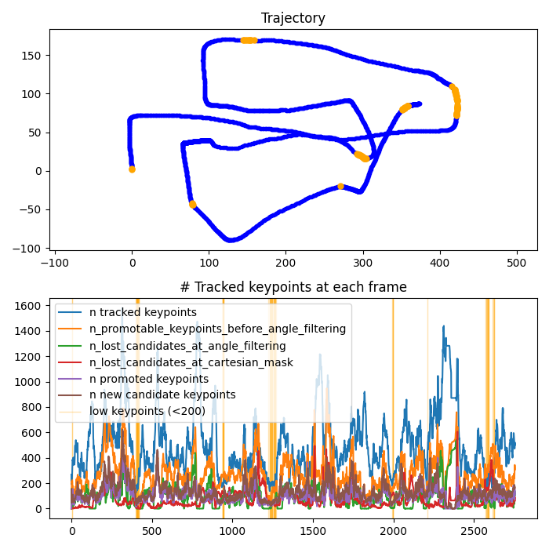

<h1>Anton Pollak</h1>

<strong>MSc Robotics, Systems and Control student at ETH Zurich</strong>

## Current projects
### *Perception and Learning for Robotics* class: Project on RL
- Class of Spring 2025 at the Robotic Systems Lab at ETH

---

### *Autonomous River Cleanup (ARC)*: Robotics Engineer Volunteer
- Student project at the Robotic Systems Lab ETH ([website](https://riverclean.ethz.ch))
- Working on the Mobile Autonomous Recycling Container (MARC) with ROS Noetic

    
    

---
---
## Previous projects
### *Stereofog*: Image-to-image machine translation enables computational defogging in real-world images
- Research internship in at the University of Utah, USA
- Scholarship by the German Academic Exchange Service (DAAD)
- Paper published in Optics Express: [DOI](https://doi.org/10.1364/OE.532576)
- Further info on Github page: [GitHub](https://github.com/acpoll/stereofog)

    

---

### *Bachelor thesis*: Optimized Operation Management With Predicted Filling Levels of the Litter Bins for a Fleet of Autonomous Urban Service Robots
- Within MARBLE (**M**obile **A**utonomous **R**o**B**ot for **L**itter Bin **E**mptying) project at TU Berlin
- Paper published in IEEE Access: [DOI](https://doi.org/10.1109/access.2024.3352436)

    

---

### *Robotics Systems* class: Chess-playing robotic arm
- During exchange semester at the University of Melbourne, Australia
- Construction of a robotic arm to manipulate pieces on a chess board & implementation from scratch in Matlab
- Link to final demo video: https://youtu.be/MSCJdkJYSEA

<!-- 

     

 -->

      

---

### *Real-World Robotics* class: Construction of a robotic hand and Application of Imitation Learning
- Class of Fall 2024 at the Soft Robotics Lab at ETH
- Hardware design of a robotic hand based on a design provided by the lab
- Execution of teleoperation tasks with the hand mounted on a Franka Emika robotic arm
- Application of Imitation Learning for autonomous cube sorting

---

### *Vision Algorithms for Mobile Robotics* class: Visual Odometry pipeline project
- Class of Fall 2024 at the Robotics and Perception Group (RPG) at University of Zurich
- Group bonus project: Design of a visual odometry pipeline
- Techniques used: Shi-Tomasi algorithm, SIFT, Kanade-Lucas- Tomasi (KLT) algorithm, RANSAC  [^1]

     
    

[^1]: Image attribution: [KITTI dataset](https://www.cvlibs.net/datasets/kitti/)

---

Used template: https://github.com/plpxsk/primer-template/tree/main